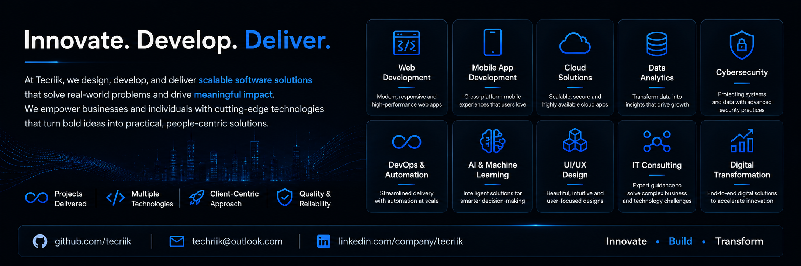

<div align="center">



<br/><br/>

[](https://git.io/typing-svg)

<br/>

[](https://tecriik.netlify.app)
[](mailto:hello@tecriik.com)
[](https://linkedin.com/company/tecriik)
[](https://x.com/tecriik)
[](https://github.com/tecriik)


</div>

<br/>


## 🌟 About Us

<table>
<tr>
<td width="60%" valign="top">

At **Tecriik**, we believe technology should solve real-world problems. Our team specializes in designing, developing, and deploying **scalable software solutions** for startups, enterprises, and entrepreneurs.

Our mission is to empower businesses with cutting-edge technologies that drive **efficiency**, **innovation**, and **long-term success** — turning bold ideas into products people actually use.

> 💡 *"We don't just write code — we engineer outcomes."*

</td>
<td width="40%" valign="top" align="center">

```
   ┌───────────────┐
   │   IDEA   💡    │
   └───────┬───────┘
           ▼
   ┌───────────────┐
   │  DESIGN  🎨    │
   └───────┬───────┘
           ▼
   ┌───────────────┐
   │  BUILD   ⚙️    │
   └───────┬───────┘
           ▼
   ┌───────────────┐
   │  SCALE   🚀    │
   └───────────────┘
```

</td>
</tr>
</table>

<br/>

## 💼 What We Do

<div align="center">

| | | |
|:---:|:---:|:---:|
| 🌐 **Web Development** | 📱 **Mobile App Development** | ☁️ **Cloud Solutions** |
| 🤖 **AI & Machine Learning** | 📊 **Data Analytics** | 🔒 **Cybersecurity** |
| ⚙️ **DevOps & Automation** | 🎨 **UI/UX Design** | 💡 **IT Consulting** |
| &nbsp; | 🚀 **Digital Transformation** | &nbsp; |

</div>

<br/>

## 🛠️ Technology Stack

<div align="center">

**Frontend**
<br/>


<br/><br/>

**Backend**
<br/>


<br/><br/>

**Database**
<br/>


<br/><br/>

**Cloud & DevOps**
<br/>


<br/><br/>

**AI & Data**
<br/>

&nbsp;


</div>

<br/>


## 🎯 Vision & Mission

<table>
<tr>
<td width="50%" valign="top">

### 🎯 Our Vision
To become a **globally recognized technology company** that delivers innovative, reliable, and impactful digital solutions.

</td>
<td width="50%" valign="top">

### 🚀 Our Mission
- Deliver world-class software products
- Foster innovation through emerging technologies
- Build long-lasting client relationships
- Create technology that makes a difference

</td>
</tr>
</table>

<br/>

## 📂 Featured Projects

<div align="center">

🚧 **Coming Soon...** 🚧

Stay tuned as we showcase our latest products, open-source contributions, and innovative solutions.


</div>

<br/>

## 🤝 Why Choose Tecriik?

<div align="center">

| ✅ | ✅ | ✅ |
|:---|:---|:---|
| Experienced Development Team | Agile Development Process | Secure & Scalable Architecture |
| Modern Technology Stack | Client-Centric Approach | End-to-End Support |
| Continuous Innovation | | |

</div>

<br/>

## 📈 Core Values

<div align="center">


</div>

<br/>


## 🤝 Contributing

We welcome contributions from developers, designers, and technology enthusiasts!

```bash
1. Fork the repository
2. Create your feature branch    → git checkout -b feature/amazing-feature
3. Commit your changes           → git commit -m "Add amazing feature"
4. Push to the branch            → git push origin feature/amazing-feature
5. Open a Pull Request 🎉
```

<br/>

## 🌐 Connect With Us

<div align="center">

<a href="mailto:hello@tecriik.com" target="_blank">
  
</a>
&nbsp;
<a href="https://tecriik.netlify.app" target="_blank">
  
</a>
&nbsp;
<a href="https://linkedin.com/company/tecriik" target="_blank">
  
</a>
&nbsp;
<a href="https://x.com/tecriik" target="_blank">
  
</a>
&nbsp;
<a href="https://github.com/tecriik" target="_blank">
  
</a>

</div>

<br/>

## ⭐ Support

<div align="center">

If you like our work, consider giving this repository a ⭐ — it helps us grow and motivates us to build more amazing projects for the community!

<br/>

**🚀 Innovate • Build • Transform**

*Made with ❤️ by **Tecriik***

</div>
